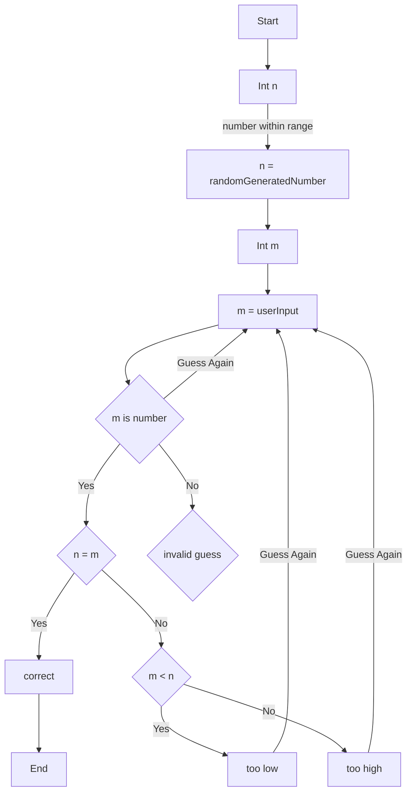

At line 3, we start the program intitially. Next, we generate a random number within a range and then store it in the variable "n." Then, the chart directs it to the user to enter their guess and store it within the variable "m." After that if the guess is not a number we redirect the user to guess again. Then we check if the guess and the random generator is equal. If the guess is correct, then the program ends. If the guesses are incorrect the guide then checks if the number is less than the number generated, if it is less than our system prints out too low. If it is not less than then it shows it is too high. Then, in both instances the user is redirected to guess again. 
