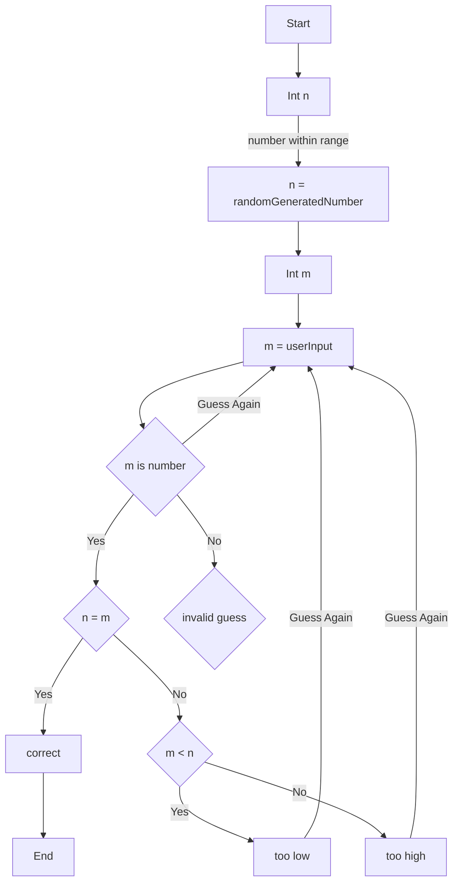

```mermaid
flowchart TD
    A[Start] --> B[Int n]
    B -- number within range --> C[n = randomGeneratedNumber]
    C --> D[Int m]
    D --> E[m = userInput]
    E --> K{m is number}
    K -- Yes --> F{n = m}
    K -- No --> L{invalid guess}
    K -- Guess Again --> E
    F -- No --> G{m < n }
    F -- Yes --> I[correct]
    G -- No --> H[too high]
    G -- Yes --> J[too low]
    H -- Guess Again --> E 
    J -- Guess Again --> E
    I --> Z[End]
```
